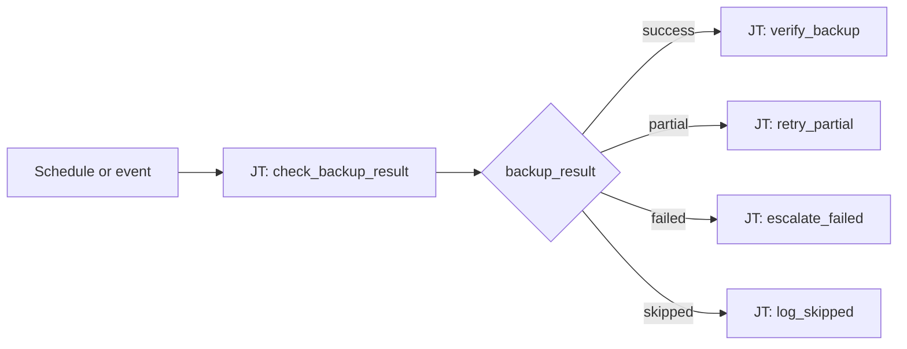

# Backup Management 101: Backup Result Routing

**Status: Active** — playbooks and AO workflow JSON included.

## What this demo shows

Backup jobs often return outcomes that binary workflows mishandle. Switch on `backup_result`:

| `backup_result` | Action |
|---|---|
| `success` | Verify restore point, log OK |
| `partial` | Retry failed targets, notify ops |
| `failed` | Escalate, open incident |
| `skipped` | Log reason, check schedule |

## Workflow



## Playbooks

| Playbook |
|---|
| [`check_backup.yml`](playbooks/check_backup.yml) |
| [`escalate_backup.yml`](playbooks/escalate_backup.yml) |
| [`log_skipped.yml`](playbooks/log_skipped.yml) |
| [`notify_chatroom.yml`](playbooks/notify_chatroom.yml) |
| [`retry_backup.yml`](playbooks/retry_backup.yml) |
| [`verify_backup.yml`](playbooks/verify_backup.yml) |

## Artifacts

```
  ao/
    backup-management-101.json
  playbooks/
    check_backup.yml
    escalate_backup.yml
    log_skipped.yml
    notify_chatroom.yml
    retry_backup.yml
    verify_backup.yml
  README.md
  SETUP_GUIDE.md
```
