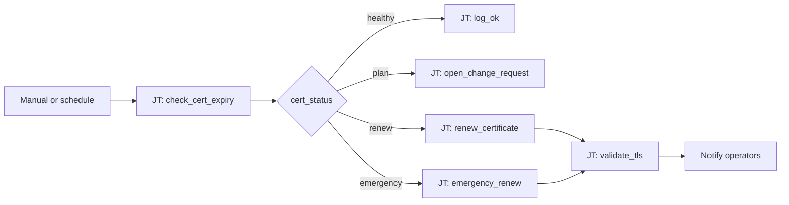

# Certificate Rotation 102: Expiry Threshold Routing

**Status: Active** — playbooks and AO workflow JSON included.

## What this demo shows

Rule-based certificate expiry handling — distinct from  [Intelligent Cert Lifecycle](../cert-lifecycle/) which uses an AI agent to pick renewal templates. This demo switches on `cert_status` from days remaining — no LLM required.

| `cert_status` | Days remaining | Action |
|---|---|---|
| `healthy` | > 60 | Skip — no action |
| `plan` | 30–60 | Open change request |
| `renew` | 7–30 | Run renewal playbook |
| `emergency` | < 7 | Renew + alert + verify chain |

**One-liner:** *Expiry isn't pass/fail — it's a countdown.*

## Workflow



## Playbooks

| Playbook |
|---|
| [`check_cert_expiry.yml`](playbooks/check_cert_expiry.yml) |
| [`emergency_renew.yml`](playbooks/emergency_renew.yml) |
| [`notify_chatroom.yml`](playbooks/notify_chatroom.yml) |
| [`open_change_request.yml`](playbooks/open_change_request.yml) |
| [`renew_cert.yml`](playbooks/renew_cert.yml) |
| [`skip_healthy.yml`](playbooks/skip_healthy.yml) |
| [`validate_tls.yml`](playbooks/validate_tls.yml) |

## Relationship to other cert demos

| Demo | Approach |
|---|---|
|  [Intelligent Cert Lifecycle](../cert-lifecycle/) | AI agent selects PEM vs keystore renewal (active) |
| **102 Expiry Threshold Routing** (this) | Rule-based switch on days remaining |
| [201 Risk-Based Routing](../risk-based-routing/) | AI-assessed risk tier |
| [301 Proactive Assessment](../proactive-assessment/) | Scheduled estate-wide scan |

## Artifacts

```
  ao/
    cert-expiry-switch-101.json
  playbooks/
    check_cert_expiry.yml
    emergency_renew.yml
    notify_chatroom.yml
    open_change_request.yml
    renew_cert.yml
    skip_healthy.yml
    validate_tls.yml
  README.md
  SETUP_GUIDE.md
```
