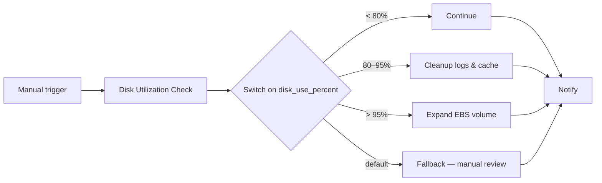

# Disk Utilization & Remediation Workflow

Monitor filesystem usage on a Linux host and respond proportionally — from "all good" through automated cleanup to EBS volume expansion — then tell the team in Mattermost what happened.

## How the use case works

Every ops team deals with disk pressure. The wrong automation treats it as binary: either ignore it or panic. This workflow encodes how you'd actually triage it:

| Situation | What happens |
|---|---|
| Disk is healthy (`< 80%`) | Log and notify — no changes to the host |
| Disk is elevated (`80–95%`) | Reclaim space: dnf package cache and old log archives, then report how much was freed |
| Disk is critical (`> 95%`) | Expand the root EBS volume in AWS, grow the partition and XFS filesystem on the host, report before/after volume size |
| Switch can't classify (default port) | No automated fix — notify as unsupported and flag for manual review |

The flow is always the same shape: **check → route → remediate → notify**. Ansible playbooks do the work on the host (and AWS for expand). Automation orchestrator wires the steps together and passes artifacts between them so each job knows what the previous one found.

## Why a switch — not success/failure branching

| Classic workflow branching | automation orchestrator switch |
|---|---|
| Success / failure / always | Route on a **value** (`disk_use_percent`) |
| Nested decision steps | One switch, four ports |
| One recovery playbook with `when:` soup | Small single-purpose job templates |

The check playbook publishes `disk_use_percent` (as a **number**) and `disk_tier` via `set_stats`. The AO **Switch** routes on `disk_use_percent` using comparison expressions (`< 80`, `>= 80 and <= 95`, `> 95`). Ansible requires quoted Jinja in YAML (`disk_use_percent: "{{ ... }}"`); unquoted `{{ ... }}` at the start of a value is a syntax error. To keep `disk_use_percent` numeric, `set_stats` passes a single Jinja dict expression so `disk_use_percent | int` stays an integer in the artifact payload. After a check run, confirm **Input → Schema** on the Switch step shows `number`, not `string`.

## Workflow



## Docs

| Document | Purpose |
|---|---|
| [SETUP_GUIDE.md](SETUP_GUIDE.md) | Step-by-step environment setup |

Import [`ao/disk-demo-101.json`](ao/disk-demo-101.json) — this is the **working nostromo export** with all four branches and per-branch notify steps. Activity UUIDs and `credential_id` are environment-specific; update `job_template_id` values if your Controller IDs differ.

### Nostromo job template map

| JT ID | Name | Playbook |
|---|---|---|
| 115 | Disk Utilization Check | `check_disk.yml` |
| 116 | Linux - Remediate - Disk Cleanup | `remediate_disk_cleanup.yml` |
| 117 | Notify Chatroom | `notify_chatroom.yml` |
| 118 | Linux - Remediate - Continue | `remediate_disk_continue.yml` |
| 119 | Linux - Remediate - Disk Expand | `remediate_disk_expand.yml` |
| 120 | Disk Utilization - Fallback | `remediate_disk_fallback.yml` |

## Switch routing

| Switch port | Condition | Remediate | Notify title |
|---|---|---|---|
| `<80%` | `disk_use_percent < 80` | Continue — no action | Disk Utilization OK (green) |
| `80-95%` | `>= 80 and <= 95` | Cleanup dnf cache + old logs | Warning — Disk Cleanup (orange) |
| `>95%` | `disk_use_percent > 95` | Expand EBS + grow filesystem | Critical — Disk Expanded (purple) |
| `default` | missing or non-numeric artifact | Fallback — manual review | Unsupported Disk Tier (red) |

Thresholds match `group_vars/all.yml` (`disk_warn_threshold: 80`, `disk_critical_threshold: 95`). Use `>=` / `<=` on the warn port so boundary values (80 and 95) route correctly.

## Setup

See [SETUP_GUIDE.md](SETUP_GUIDE.md) for infrastructure prerequisites, AAP job templates, Mattermost configuration, and AO workflow import.

## Testing branches without filling the disk

`check_disk.yml` accepts `test_disk_use_percent` as an extra var. When set, it skips live `df` and simulates usage for routing.

On the **Check** step in AO, set `extra_vars`:

| Branch | `test_disk_use_percent` |
|---|---|
| Continue (`<80%`) | `75` |
| Cleanup (`80-95%`) | `85` |
| Expand (`>95%`) | `96` |
| Default / fallback | omit `test_disk_use_percent` on a host with a missing mount, or pass a non-numeric value |

Remove `test_disk_use_percent` (or leave empty) for a real disk check.

The exported workflow currently has `"test_disk_use_percent": 50` on the check step — safe default that routes to **Continue**. Change or remove it before a production run.

## Per-branch notify pattern

Each remediate branch has its **own** notify step (same JT 117). Every notify `extra_vars` key references **only** the upstream remediate activity on that branch — never a mix of cleanup + expand + continue in one block.

Example — warn path references cleanup only:

```json
"disk_use_percent": "${activity_5f6d0c2e_a677_4517_b013_ab2a9f8c2d59.artifacts.disk_use_percent}"
```

This avoids AO namespace errors when a converged notify step tries to read artifacts from branches that never ran.

### Artifact contract

Every remediate playbook publishes the same keys via `playbooks/tasks/publish_notify_artifacts.yml`:

`notify_host`, `disk_mount`, `disk_use_percent`, `disk_tier`, `remediation_action`, `disk_use_percent_before/after`, `total_reclaimed_mb`, `dnf_cache_*`, `logs_*`, `log_retention_days`, `dry_run`, `disk_expand_gb`, `volume_size_before_gb`, `volume_size_after_gb`

Branch-irrelevant fields are `unknown` / `0` / `false`. Re-sync the SCM project and re-run remediate before testing notify if you see `Key '...' not found in namespace path`.

## Playbooks

| Playbook | What it does | Runs on |
|---|---|---|
| [`check_disk.yml`](https://github.com/ansible-tmm/aap-orchestrator-demos/blob/main/disk-utilization/playbooks/check_disk.yml) | Reads filesystem usage on the target mount and publishes `disk_use_percent` and `disk_tier` artifacts for the switch. | RHEL EC2 node |
| [`remediate_disk_continue.yml`](https://github.com/ansible-tmm/aap-orchestrator-demos/blob/main/disk-utilization/playbooks/remediate_disk_continue.yml) | Healthy path when disk is below the warning threshold — logs status and publishes notify artifacts with no changes to the host. | RHEL EC2 node |
| [`remediate_disk_cleanup.yml`](https://github.com/ansible-tmm/aap-orchestrator-demos/blob/main/disk-utilization/playbooks/remediate_disk_cleanup.yml) | Reclaims dnf package cache and old log archives, then publishes before/after usage stats for the warning notify tier. | RHEL EC2 node |
| [`remediate_disk_expand.yml`](https://github.com/ansible-tmm/aap-orchestrator-demos/blob/main/disk-utilization/playbooks/remediate_disk_expand.yml) | Increases the root EBS volume in AWS, then runs `growpart` and `xfs_growfs` on the host for the critical expand path. | AWS (localhost) + RHEL EC2 node |
| [`remediate_disk_fallback.yml`](https://github.com/ansible-tmm/aap-orchestrator-demos/blob/main/disk-utilization/playbooks/remediate_disk_fallback.yml) | Handles unexpected switch tiers (e.g. boundary values) with no remediation and publishes artifacts for the unsupported notify template. | RHEL EC2 node |
| [`notify_chatroom.yml`](https://github.com/ansible-tmm/aap-orchestrator-demos/blob/main/disk-utilization/playbooks/notify_chatroom.yml) | Includes the tier-specific Mattermost template (ok / warn / critical / unsupported) and posts the remediation summary to chat. | localhost (Mattermost API) |

Notify templates live under `playbooks/tasks/notify/`. Warn and critical templates have separate check-mode vs run-mode wording.

## Critical path — EBS expand

`remediate_disk_expand.yml` runs three plays:

1. **Discover** — resolve EC2 instance ID (inventory, IMDS, or AWS IP lookup)
2. **AWS (localhost)** — increase root EBS volume by `disk_expand_gb` (default 5 GiB)
3. **Linux host** — `growpart` + `xfs_growfs` on the mount

Target layout (RHEL 9 on EC2): GPT disk `/dev/nvme0n1`, root partition `nvme0n1p4`, XFS on `/`.

If `disk_use_percent` is not passed through AO extra_vars, the expand playbook reads it from live `df` before publishing artifacts.

## Live disk testing (optional)

```bash
./test/show_disk_tier.sh        # see current tier
./test/fill_disk.sh 85          # trigger warn
./test/fill_disk.sh 96          # trigger critical
```
