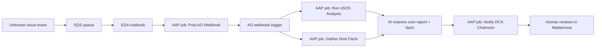

# Event-Driven xSOS RCA

**Status: Active (nostromo)** — SQS → EDA → AO webhook path verified. Playbooks and rulebook in this repo support automated root-cause analysis with [xSOS](https://github.com/ryran/xsos) on the affected host.

## What this demo shows

A monitoring or ticketing integration cannot classify an incident. Instead of guessing a remediation playbook, automation:

1. Receives an **unknown issue** event from **AWS SQS**
2. **EDA** launches an AAP job that **POSTs** the event to the **automation orchestrator (AO) webhook**
3. **AO** starts a workflow and launches **Linux - Run xSOS Analysis** and **Linux - Gather Host Facts** in parallel on the reported host
4. **xSOS** collects a fast, human-readable system summary; the facts playbook publishes structured OS/CPU/memory/load artifacts alongside it
5. An AO **Task Agent (AI)** step reasons over both artifact sets and produces a plain-language RCA summary
6. **Linux - Notify RCA Chatroom** posts that summary to **Mattermost** for a human to read and decide next steps

This pattern complements automation orchestrator agent workflows: EDA reacts to the event; xSOS and the facts playbook gather evidence in parallel; a Task agent reasons over both; a human reviews the result in chat.

## Suggested folder name

`event-driven-xsos-rca` (this folder) reads better in a demo catalog than `unknown_error_xsos`. The queue and tags still use `unknown-issue` language where it helps operators.

## Workflow

On **AAP**, EDA cannot call an external webhook directly. The supported path routes through Controller:

```text
AWS SQS  →  EDA rulebook  →  run_job_template (Post AO Webhook)  →  AO webhook  →  Run xSOS Analysis
```



The extra Controller hop is **expected platform behavior**, not a workaround. See [EDA actions on AAP](#eda-actions-on-aap) below.

## EDA actions on AAP

`ansible-rulebook` supports `run_module`, `run_playbook`, `run_job_template`, and `run_workflow_template`. On **AAP-managed EDA activations**, only **Controller-backed actions** are supported:

| Action | AAP EDA activation | Notes |
|--------|-------------------|-------|
| `run_job_template` | **Supported** | What this demo uses |
| `run_workflow_template` | **Supported** | Alternative for multi-step Controller workflows |
| `run_module` | **Not supported** | Needs `--inventory` at worker startup; EDA UI has no inventory field |
| `run_playbook` | **Not supported** | Documented as CLI-only on AAP 2.6 |

**Why:** AAP EDA was designed so rulebooks do not run automation outside Automation Controller. The rulebook engine still allows `run_module` when you run `ansible-rulebook` locally with `-i inventory.ini`, but the EDA controller worker does not pass inventory and will fail at startup with `needs inventory to be defined`.

**Product guidance (EDA PM):** On AAP, use `run_job_template` or `run_workflow_template`. Direct `run_module` / `run_playbook` from an activation is not the supported integration path.

For AO specifically, the practical chain is:

```text
event source (e.g. AWS SQS) → EDA → Job Template → AO webhook → AO workflow → AAP jobs
```

An alternate rulebook using `run_module` + `ansible.builtin.uri` lives at [`eda/rulebook-run-module.yml`](eda/rulebook-run-module.yml) for **local CLI testing only**. Do not enable it as an AAP activation.

## Playbooks

| Playbook | Purpose | When to run |
|---|---|---|
| [`setup_sqs_queue.yml`](playbooks/setup_sqs_queue.yml) | Create the SQS queue (one-time) | Once per AWS account/region |
| [`publish_unknown_issue_event.yml`](playbooks/publish_unknown_issue_event.yml) | Push a demo event to SQS | Manual test / smoke test |
| [`post_ao_webhook.yml`](playbooks/post_ao_webhook.yml) | POST event JSON to AO webhook | **EDA** via `run_job_template` (JT: Linux - Post AO Webhook) |
| [`run_xsos_analysis.yml`](playbooks/run_xsos_analysis.yml) | Install xSOS, run analysis, save report, publish artifacts | **AO workflow** (JT: Linux - Run xSOS Analysis) |
| [`gather_host_facts.yml`](playbooks/gather_host_facts.yml) | Gather Linux facts (OS, CPU, memory, load, mounts) and publish artifacts | **AO workflow**, in parallel with xSOS analysis (JT: Linux - Gather Host Facts) |
| [`notify_chatroom.yml`](playbooks/notify_chatroom.yml) | Post an AI-generated RCA summary to Mattermost | **AO workflow**, after an AI/Task Agent step reasons over the artifacts (JT: Linux - Notify RCA Chatroom) |

### Facts and artifacts published via `set_stats`

`run_xsos_analysis.yml` and `gather_host_facts.yml` both run against the reported host and publish their findings with `ansible.builtin.set_stats`, so every value below is available as an artifact on later AO workflow steps (including an AI/Task Agent step) without re-reading the host:

| Source playbook | Artifacts |
|---|---|
| `run_xsos_analysis.yml` | `analyzed_host`, `issue_summary`, `analyzed_at`, `xsos_report_path`, `xsos_report_preview` |
| `gather_host_facts.yml` | `analyzed_host`, `gathered_at`, `os_distribution`, `kernel`, `architecture`, `uptime_seconds`, `total_memory_mb`, `free_memory_mb`, `swap_total_mb`, `swap_free_mb`, `cpu_count`, `load_1m`/`load_5m`/`load_15m`, `default_ipv4`, `mounts`, `selinux_status` |

`notify_chatroom.yml` expects an `ai_summary` (or `rca_summary`) extra var — the text an AO AI/Task Agent step produced after reasoning over the artifacts above — plus `notify_host`, `issue_summary`, `os_distribution`, and `xsos_report_path` to build the Mattermost message. All have sane defaults if a field wasn't threaded through.

## Quick start

### 1. One-time queue setup

Requires AWS credentials with permission to create SQS queues (`amazon.aws` collection).

```bash
cd event-driven-xsos-rca
ansible-playbook -i inventory/hosts.yml playbooks/setup_sqs_queue.yml
```

Copy the printed **Queue URL** into `inventory/group_vars/all.yml`:

```yaml
sqs_queue_url: https://sqs.us-east-1.amazonaws.com/123456789012/aap-unknown-issue-rca
```

### 2. Configure inventory

Set the host xSOS should analyze:

```bash
export RCA_TARGET_HOST=10.0.1.50
export RCA_TARGET_USER=ec2-user
export RCA_TARGET_SSH_KEY=~/.ssh/my-key.pem
```

Update `inventory/group_vars/all.yml`:

```yaml
target_host: rca-target
```

### 3. Publish a demo event

```bash
ansible-playbook -i inventory/hosts.yml playbooks/publish_unknown_issue_event.yml \
  -e issue_summary="API latency spike on web tier — cause unknown"
```

Sample payload shape: [`test/sample_event.json`](test/sample_event.json).

### 4. EDA rulebook and activation

Rulebook (AAP): [`extensions/eda/rulebooks/event-driven-xsos-rca.yml`](../extensions/eda/rulebooks/event-driven-xsos-rca.yml)

Full setup checklist: [`eda/SETUP_EDA.md`](eda/SETUP_EDA.md)

Summary:

1. Sync the Git project in **Automation Decisions → Projects**
2. Create job templates:
   - **`Linux - Post AO Webhook`** → `event-driven-xsos-rca/playbooks/post_ao_webhook.yml` (called by EDA)
   - **`Linux - Run xSOS Analysis`** → `event-driven-xsos-rca/playbooks/run_xsos_analysis.yml` (called by AO workflow)
   - **`Linux - Gather Host Facts`** → `event-driven-xsos-rca/playbooks/gather_host_facts.yml` (called by AO workflow, in parallel with the xSOS step — same inventory/credential as xSOS)
   - **`Linux - Notify RCA Chatroom`** → `event-driven-xsos-rca/playbooks/notify_chatroom.yml` (called by AO workflow, after the AI reasoning step — needs `api_chat_token` on the Mattermost credential, same as the disk-utilization demo's Notify Chatroom template). Use an execution environment with the `community.general` collection (e.g. the `Rhel` EE); the default supported EE doesn't ship it and the `mattermost` module will fail to resolve.
3. Create an AO workflow with an **EDA webhook trigger**; copy the webhook URL into activation extra vars
4. Fan the webhook trigger out to **Run xSOS Analysis** and **Gather Host Facts** in parallel, join both into a **Task Agent (AI)** step prompted to summarize host health from the published artifacts, then route its output as `ai_summary` into **Notify RCA Chatroom**
5. **Create an AO service account** for webhook auth (see [Service account setup](#service-account-setup) below)
6. Create a rulebook activation with **AAP Controller credential**, **AWS SQS credential**, and extra vars:

```yaml
aws_region: us-east-1
xsos_event_queue_name: aap-unknown-issue-rca
ao_webhook_url: http://<ao-host>:8080/api/v1/webhooks/eda/<uuid>
ao_webhook_validate_certs: false
ao_webhook_client_id: "<service account client_id>"
ao_webhook_client_secret: "<service account client_secret>"
```

7. Run `publish_unknown_issue_event.yml` — within ~5 seconds EDA should launch **Post AO Webhook**, then AO should start the xSOS workflow

The rulebook uses **`run_job_template`**, not `run_module`, because AAP EDA only supports Controller-backed actions. The SQS source exposes your JSON payload as **`event.body`** in the rulebook (not `event.payload`).

### 5. Manual test (without EDA)

```bash
ansible-playbook -i inventory/hosts.yml playbooks/run_xsos_analysis.yml \
  -e _host=rca-target \
  -e issue_summary="Manual xSOS smoke test"

ansible-playbook -i inventory/hosts.yml playbooks/gather_host_facts.yml \
  -e _host=rca-target
```

Reports land on the target under `xsos_output_dir` (default `/var/tmp/xsos-rca/`). Both playbooks publish their findings via `set_stats` for downstream AO steps — run them back-to-back locally, or in parallel from AO, since neither depends on the other.

Once you have an AI-generated summary (from an AO Task Agent step, or typed in for a smoke test), try the notify step on its own:

```bash
ansible-playbook -i inventory/hosts.yml playbooks/notify_chatroom.yml \
  -e notify_host=rca-target \
  -e issue_summary="Manual xSOS smoke test" \
  -e ai_summary="CPU and memory look healthy; load average is elevated due to a stuck backup job — recommend killing PID 4821 and re-running the backup off-peak." \
  -e api_chat_token="<mattermost bot token>"
```

## Service account setup

Automation orchestrator requires a **service account** to authenticate incoming webhook requests. The `post_ao_webhook.yml` playbook exchanges the service account's `client_id` and `client_secret` for a short-lived Bearer token (OAuth 2.0 client credentials grant) before calling the webhook.

### 1. Create a service account

In automation orchestrator, go to **Access Management → Service Accounts** and create a new service account (e.g. `sean-service-account`).


### 2. Create a credential and save the client ID / secret

On the service account's **Credentials** tab, create a new credential. AO will display the `client_id` and `client_secret` **once** — copy both values immediately. If you lose them, you'll need to rotate to a new credential.

### 3. Assign a role with webhook access

On the service account's **Assignments** tab, assign a role that grants access to invoke webhook triggers (e.g. `project-user` on the project that owns the workflow).


### 4. Authorize the service account on the webhook trigger

In the AO workflow editor, open the **EDA trigger** step. Under **Authorized service accounts**, select the service account you created. Publish the workflow after saving.


### 5. Add credentials to the EDA activation

Set `ao_webhook_client_id` and `ao_webhook_client_secret` as extra vars on the **rulebook activation** in AAP. Do not commit these values to the repository.

```yaml
ao_webhook_client_id: "nx_sa_..."
ao_webhook_client_secret: "<secret from step 2>"
```

The playbook automatically derives the token endpoint from the webhook URL (`/api/v1/auth/token` on the same host).

### How the OAuth 2.0 flow works

```text
post_ao_webhook.yml
  │
  ├─ Step 1: POST /api/v1/auth/token
  │    body: grant_type=client_credentials&client_id=...&client_secret=...
  │    ← 200 { "access_token": "eyJ...", "token_type": "bearer", "expires_in": 900 }
  │
  └─ Step 2: POST /api/v1/webhooks/eda/<uuid>
       Authorization: Bearer eyJ...
       body: { "issue_id": ..., "host": ..., ... }
       ← 202 Accepted
```

## Prerequisites

| Component | Required | Notes |
|---|---|---|
| RHEL host | Yes | SSH from AAP; xSOS and the facts playbook run on the affected system |
| AWS account | Yes | SQS queue + credentials on controller |
| AAP Controller | Yes | Job templates for the five playbooks |
| Mattermost | Yes | Chat destination for the AI-generated RCA summary |
| EDA | Yes | SQS source → `run_job_template` → Post AO Webhook → AO |
| AAP Controller credential on EDA activation | Yes | Required for `run_job_template` |
| AO service account | Yes | OAuth 2.0 client credentials for webhook auth — see [Service account setup](#service-account-setup) |
| `amazon.aws` collection | Yes | SQS source plugin in decision environment |

## IAM (minimum)

**Setup / publish (controller):**

- `sqs:CreateQueue`, `sqs:GetQueueUrl`, `sqs:GetQueueAttributes`, `sqs:SendMessage`

**EDA SQS source:**

- `sqs:ReceiveMessage`, `sqs:DeleteMessage`, `sqs:GetQueueAttributes`

Use an instance role, access keys in a credential, or AAP cloud credential — match your environment.

## AWS credentials: laptop vs. AAP

`setup_sqs_queue.yml` and `publish_unknown_issue_event.yml` are the two playbooks you'd run manually (setup once, publish to smoke-test) — but they also work unmodified as AAP job templates. Both auto-detect which credential to use:

- **AAP job template with an AWS credential attached** — the credential injects `AWS_ACCESS_KEY_ID`/`AWS_SECRET_ACCESS_KEY` into the job's environment. The playbooks detect that automatically and use it, ignoring the `saml` default entirely. No extra vars needed.
- **Local laptop, no AWS credential in the environment** — falls back to your `saml` SSO profile.

You don't need to pass `aws_profile` as an extra var in either case; it "just works" based on what's actually available.

### Local re-login (laptop)

The `saml` session expires periodically (Kerberos ticket + SAML token), so if a local run fails with `ProfileNotFound` or `ExpiredToken`, refresh it and retry:

```bash
# 1. Make sure you're on VPN (needed to reach the Kerberos KDC)
# 2. Get a fresh Kerberos ticket
kinit yourid@REDHAT.COM

# 3. Refresh the AWS SAML session into the "saml" profile
aws-saml.py --target-profile saml

# 4. Retry the playbook
ansible-playbook -i inventory/hosts.yml playbooks/publish_unknown_issue_event.yml
```

Check `klist` first if you're not sure whether you already have a valid ticket — `Cache not found` means you need to `kinit` again.

## Next steps

- Wire the AI reasoning step: xSOS + host facts artifacts → Task Agent → **Notify RCA Chatroom** → optional approval → remediation job template
- Register on the demo site in `_data/demos.yml` when ready to publish
