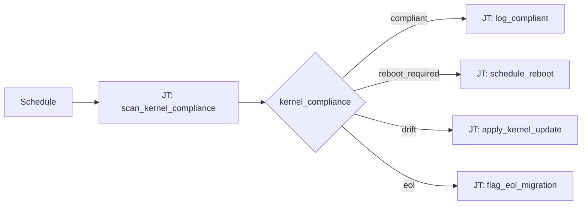

# Kernel Compliance 101: Kernel Compliance Routing

**Status: Active** — playbooks and AO workflow JSON included.

## What this demo shows

Switch on kernel compliance state from a scan playbook:

| `kernel_compliance` | Action |
|---|---|
| `compliant` | Log OK |
| `reboot_required` | Schedule maintenance reboot |
| `drift` | Apply kernel update playbook |
| `eol` | Flag for migration planning |

## Workflow



## Playbooks

| Playbook |
|---|
| [`apply_kernel_update.yml`](playbooks/apply_kernel_update.yml) |
| [`check_kernel.yml`](playbooks/check_kernel.yml) |
| [`flag_eol_migration.yml`](playbooks/flag_eol_migration.yml) |
| [`log_compliant.yml`](playbooks/log_compliant.yml) |
| [`notify_chatroom.yml`](playbooks/notify_chatroom.yml) |
| [`schedule_reboot.yml`](playbooks/schedule_reboot.yml) |

## Artifacts

```
  ao/
    kernel-compliance-101.json
  playbooks/
    apply_kernel_update.yml
    check_kernel.yml
    flag_eol_migration.yml
    log_compliant.yml
    notify_chatroom.yml
    schedule_reboot.yml
  README.md
  SETUP_GUIDE.md
```
