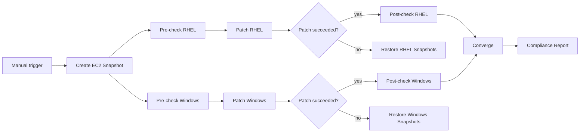

# Multi-OS Cloud Patching

Automation orchestrator version of [Patch Cloud Stack in AWS](https://github.com/ansible/product-demos/blob/main/cloud/docs/patch-cloud-stack.md) in product-demos. Orchestrates parallel RHEL and Windows patching on AWS with EBS snapshot rollback and a consolidated compliance report — no AI nodes, playbook-driven only.

## What this demo shows

| Step | What happens |
|---|---|
| Snapshot | EBS snapshots of all target EC2 instances before any changes |
| Pre-check (parallel) | Queries advisory/KB applicability on RHEL and Windows |
| Patch (parallel) | Applies targeted advisories via `dnf` (RHEL) or `win_updates` (Windows) |
| Post-check / restore | Verifies compliance; on failure, restores from EBS snapshot |
| Compliance report | Generates an HTML dashboard on the report server |

## Workflow



## Prerequisites

Follow the [Patch Cloud Stack in AWS](https://github.com/ansible/product-demos/blob/main/cloud/docs/patch-cloud-stack.md) setup in product-demos:

1. Run **APD | Multi-demo setup** (or **APD | Single demo setup** → `cloud`) to create the cloud job templates.
2. Deploy the cloud stack with **Deploy Cloud Stack in AWS** (five VMs: `aws_rhel8`, `aws_rhel9`, `aws-dc`, `aws_win1`, `reports`).
3. Configure AWS, APD Machine, and RHSM Registration credentials as described in product-demos.

## Import the automation orchestrator workflow

Import [`ao/multi-os-cloud-patching.json`](ao/multi-os-cloud-patching.json) into automation orchestrator. Update `credential_id` and `organization_name` for your AAP integration. Job template names must match the **Cloud | AWS |** templates created by product-demos setup.

Map each AO step to the corresponding AAP job template:

| AO step | AAP job template |
|---|---|
| Create EC2 Snapshot | Cloud \| AWS \| Snapshot EC2 |
| Pre-check RHEL | Cloud \| AWS \| Patch Pre-check RHEL |
| Patch RHEL | Cloud \| AWS \| Patch RHEL |
| Post-check RHEL | Cloud \| AWS \| Patch Post-check RHEL |
| Pre-check Windows | Cloud \| AWS \| Patch Pre-check Windows |
| Patch Windows | Cloud \| AWS \| Patch Windows |
| Post-check Windows | Cloud \| AWS \| Patch Post-check Windows |
| Restore RHEL/Windows Snapshots | Cloud \| AWS \| Restore EC2 from Snapshot |
| Compliance Report | Cloud \| AWS \| Patch Compliance Report |

## Related patching demos

| Demo | Type | Focus |
|---|---|---|
| [RHEL CVE Remediation](../cve-remediation/) | AI-assisted | CVE alert → AI triage → auto-patch, approve, or investigate |
| **Multi-OS Cloud Patching** (this demo) | Rule-based | Day-2 multi-OS patching with snapshot rollback |
| [Patch Severity Routing](../patch-management/) | Rule-based | Switch on scan severity → patch now, schedule, batch, or compliant |

## Playbooks

Playbooks live in [ansible/product-demos](https://github.com/ansible/product-demos/tree/main/cloud). See the [Playbooks section on the demo page](https://ansible-tmm.github.io/aap-orchestrator-demos/demos/multi-os-cloud-patching/#playbooks) for links.

| Playbook | What it does | Runs on |
|---|---|---|
| [`snapshot_ec2.yml`](https://github.com/ansible/product-demos/blob/main/cloud/snapshot_ec2.yml) | Takes EBS snapshots of target EC2 instances | AWS (localhost) |
| [`patch_pre_check_rhel.yml`](https://github.com/ansible/product-demos/blob/main/cloud/patch_pre_check_rhel.yml) | Queries dnf for targeted advisory applicability | RHEL hosts |
| [`patch_rhel.yml`](https://github.com/ansible/product-demos/blob/main/cloud/patch_rhel.yml) | Applies specific RHSA/CVE advisories via dnf | RHEL hosts |
| [`patch_post_check_rhel.yml`](https://github.com/ansible/product-demos/blob/main/cloud/patch_post_check_rhel.yml) | Verifies advisories are resolved after patching | RHEL hosts |
| [`patch_pre_check_windows.yml`](https://github.com/ansible/product-demos/blob/main/cloud/patch_pre_check_windows.yml) | Queries Windows Update Agent for targeted KB applicability | Windows hosts |
| [`patch_windows.yml`](https://github.com/ansible/product-demos/blob/main/cloud/patch_windows.yml) | Installs specific KB updates via win_updates | Windows hosts |
| [`patch_post_check_windows.yml`](https://github.com/ansible/product-demos/blob/main/cloud/patch_post_check_windows.yml) | Verifies KBs are installed after patching | Windows hosts |
| [`restore_ec2.yml`](https://github.com/ansible/product-demos/blob/main/cloud/restore_ec2.yml) | Restores EC2 volumes from latest EBS snapshot | AWS (localhost) |
| [`patch_compliance_report.yml`](https://github.com/ansible/product-demos/blob/main/cloud/patch_compliance_report.yml) | Generates HTML compliance dashboard on the report server | Report server |

## Planned artifacts

```
multi-os-cloud-patching/
  ao/
    multi-os-cloud-patching.json
  README.md
```
