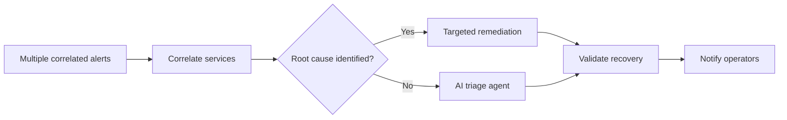

# Multi-Service Correlation

**Status: Active** — playbooks and AO workflow JSON included.

Multiple correlated alerts arrive across services. The workflow correlates them, identifies root cause when possible, and routes to targeted remediation or AI-assisted triage when not.

## Workflow

## Playbooks

| Playbook |
|---|
| [`correlate_alerts.yml`](playbooks/correlate_alerts.yml) |
| [`notify_operators.yml`](playbooks/notify_operators.yml) |
| [`targeted_remediation.yml`](playbooks/targeted_remediation.yml) |
| [`validate_recovery.yml`](playbooks/validate_recovery.yml) |
