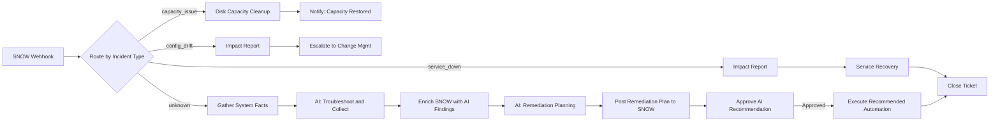

# Novel Incident Remediation

Known incident types route directly to existing AAP job templates. Unknown incidents trigger an AI agent that investigates, enriches the ServiceNow ticket with findings, then generates a remediation plan for operator approval.

## Workflow

## Four Paths

| Incident Type | Path | What Happens |
|---------------|------|--------------|
| `capacity_issue` | Deterministic | Runs disk cleanup JT, notifies SNOW when resolved |
| `service_down` | Deterministic | Generates impact report, runs service recovery JT, closes ticket |
| `config_drift` | Deterministic | Generates impact report, escalates to Change Management |
| `unknown` | AI | Gathers facts, AI investigates, enriches SNOW, AI plans remediation, operator approves, executes |

## Features Demonstrated

| Feature | Where |
|---------|-------|
| Switch routing by incident type | Route by Incident Type |
| AAP job template execution | All deterministic paths |
| AI investigation agent | AI: Troubleshoot and Collect |
| AI remediation planning agent | AI: Remediation Planning |
| Structured agent output | Both AI nodes |
| Human approval gate | Approve AI Recommendation |
| Dynamic job template launch | Execute Recommended Automation |
| ServiceNow ticket enrichment | Enrich SNOW, Notify, Close Ticket nodes |

## Files

| Path | Description |
|------|-------------|
| `ao/novel-incident-remediation.json` | AO workflow JSON - import into Ansible Automation Orchestrator |
| `aap/playbooks/gather_incident_facts.yml` | Collects system metrics from the affected host |
| `aap/playbooks/remediate_disk_cleanup.yml` | Disk capacity remediation |
| `aap/playbooks/linux_service_recovery.yml` | Linux service restart and recovery |
| `aap/playbooks/notify_snow.yml` | Updates ServiceNow ticket state and adds work notes |
| `aap/playbooks/incident_impact_report.yml` | Generates and posts impact report to SNOW |
| `aap/playbooks/incident_log_and_report.yml` | Logs unrecognized incidents and posts to SNOW |

## Quick Start

See [REQUIREMENTS.md](REQUIREMENTS.md) for full setup details.

1. Configure AAP MCP integration in AO
2. Replace credential placeholders in `ao/novel-incident-remediation.json`
3. Import the workflow JSON into AO
4. Create AAP job templates from playbooks in `aap/playbooks/`
5. Trigger via ServiceNow webhook with `incident_type` set to one of: `capacity_issue`, `service_down`, `config_drift`, `unknown`
