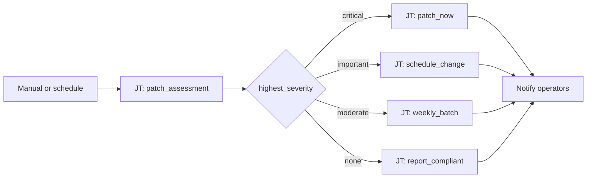

# Patch Management 101: Patch Severity Routing

**Status: Active** — playbooks and AO workflow JSON included.

## What this demo shows

Run a patch assessment playbook that publishes `highest_severity` from `dnf updateinfo` or an Insights scan. Switch on the value and route to the response that matches your change policy.

| `highest_severity` | Action |
|---|---|
| `critical` | Patch now + open maintenance window |
| `important` | Schedule change window |
| `moderate` | Add to weekly batch |
| `none` | Report compliant, exit |

## Workflow



## Playbooks

| Playbook |
|---|
| [`check_patches.yml`](playbooks/check_patches.yml) |
| [`notify_chatroom.yml`](playbooks/notify_chatroom.yml) |
| [`remediate_patch_now.yml`](playbooks/remediate_patch_now.yml) |
| [`remediate_report_compliant.yml`](playbooks/remediate_report_compliant.yml) |
| [`remediate_schedule_change.yml`](playbooks/remediate_schedule_change.yml) |
| [`remediate_weekly_batch.yml`](playbooks/remediate_weekly_batch.yml) |

## Artifacts

```
  ao/
    patch-management-101.json
  playbooks/
    check_patches.yml
    notify_chatroom.yml
    remediate_patch_now.yml
    remediate_report_compliant.yml
    remediate_schedule_change.yml
    remediate_weekly_batch.yml
  README.md
  SETUP_GUIDE.md
```
