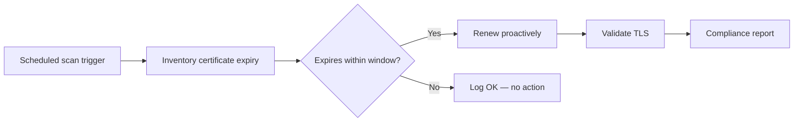

# Certificate Rotation 301: Proactive Assessment

**Status: Active** — playbooks and AO workflow JSON included.

This demo extends 201 with:

- Scheduled scanning of the full certificate estate
- AI classification across all discovered certs
- Auto-remediation for low-risk certs
- Escalation for critical certs
- Compliance reporting

## Workflow

## Playbooks

| Playbook |
|---|
| [`compliance_report.yml`](playbooks/compliance_report.yml) |
| [`log_ok.yml`](playbooks/log_ok.yml) |
| [`notify_chatroom.yml`](playbooks/notify_chatroom.yml) |
| [`renew_proactive.yml`](playbooks/renew_proactive.yml) |
| [`scan_certificates.yml`](playbooks/scan_certificates.yml) |
