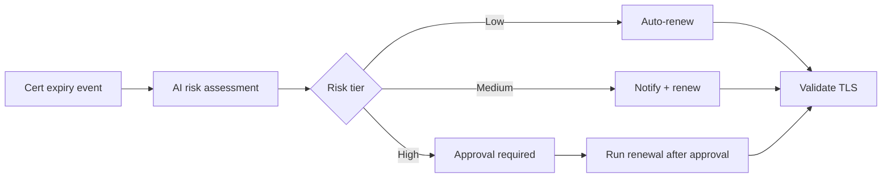

# Certificate Rotation 201: Risk-Based Routing

**Status: Active** — playbooks and AO workflow JSON included.

This demo extends 101 with:

- Risk scoring per certificate (low/medium/high)
- Switch-node routing to different approval flows per risk level
- Blast radius analysis
- Multiple hosts with different cert types

## Workflow

## Playbooks

| Playbook |
|---|
| [`assess_risk.yml`](playbooks/assess_risk.yml) |
| [`auto_renew.yml`](playbooks/auto_renew.yml) |
| [`notify_chatroom.yml`](playbooks/notify_chatroom.yml) |
| [`notify_renew.yml`](playbooks/notify_renew.yml) |
| [`validate_tls.yml`](playbooks/validate_tls.yml) |
