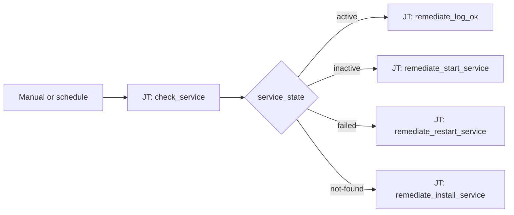

# Service Health 101: Service State Routing

**Status: Active** — playbooks and AO workflow JSON included.

## What this demo shows

One host, one service (`httpd`). Run a check playbook that publishes `service_state`. Route remediation in a single switch — no nested Controller decision trees.

| `service_state` | Path | Planned action |
|---|---|---|
| `active` | Green — done | Log OK, no changes |
| `inactive` | Yellow — start it | Start the service |
| `failed` | Orange — recover | Inspect logs and restart |
| `not-found` | Red — install | Install the package and enable the unit |

## Workflow



## Playbooks

| Playbook |
|---|
| [`check_service.yml`](playbooks/check_service.yml) |
| [`notify_chatroom.yml`](playbooks/notify_chatroom.yml) |
| [`remediate_install_service.yml`](playbooks/remediate_install_service.yml) |
| [`remediate_log_ok.yml`](playbooks/remediate_log_ok.yml) |
| [`remediate_restart_service.yml`](playbooks/remediate_restart_service.yml) |
| [`remediate_start_service.yml`](playbooks/remediate_start_service.yml) |

## Why not binary branching?

The same four outcomes in a Controller-style workflow require nested success/failure nodes that still guess at failure meaning. The switch reads one artifact and routes by **meaning**.

## Artifacts

```
  ao/
    service-health-101.json
  playbooks/
    check_service.yml
    notify_chatroom.yml
    remediate_install_service.yml
    remediate_log_ok.yml
    remediate_restart_service.yml
    remediate_start_service.yml
  README.md
  SETUP_GUIDE.md
```

## Demo ideas

- Stop `httpd` → workflow routes to **inactive** → start path
- `dnf remove httpd` → workflow routes to **not-found** → install path
