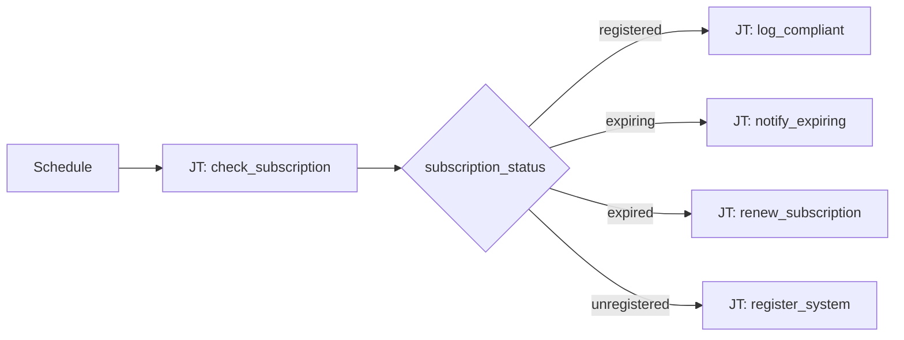

# Subscription Management 101: RHEL Subscription Routing

**Status: Active** — playbooks and AO workflow JSON included.

## What this demo shows

Switch on RHEL subscription state after a compliance check:

| `subscription_status` | Action |
|---|---|
| `registered` | Log compliant |
| `expiring` | Notify + schedule renewal |
| `expired` | Register or attach subscription |
| `unregistered` | Register with activation key |

## Workflow



## Playbooks

| Playbook |
|---|
| [`check_subscription.yml`](playbooks/check_subscription.yml) |
| [`log_compliant.yml`](playbooks/log_compliant.yml) |
| [`notify_chatroom.yml`](playbooks/notify_chatroom.yml) |
| [`notify_expiring.yml`](playbooks/notify_expiring.yml) |
| [`register_system.yml`](playbooks/register_system.yml) |
| [`renew_subscription.yml`](playbooks/renew_subscription.yml) |

## Artifacts

```
  ao/
    subscription-management-101.json
  playbooks/
    check_subscription.yml
    log_compliant.yml
    notify_chatroom.yml
    notify_expiring.yml
    register_system.yml
    renew_subscription.yml
  README.md
  SETUP_GUIDE.md
```
