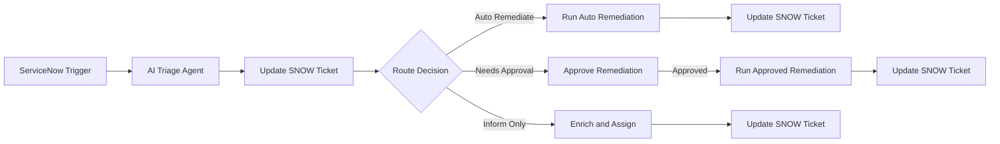

# Ticket Enrichment

**Interactive walkthrough:** [Automation Orchestrator — Ticket Enrichment](https://interact.redhat.com/share/j5xLvTSv2GAkw6szxron) (Red Hat Interact Arcade)

## What this demo shows

ServiceNow is the **ticket ingress**: an incident number arrives on a webhook (`/snow-incident`). An **AI triage agent** fetches the incident from ServiceNow via MCP, discovers available AAP job templates via AAP MCP, and classifies the incident into one of three routes: **auto-remediate**, **needs-approval**, or **inform-only**.

A **switch step** routes the workflow based on the triage output. Auto-remediate and approved paths launch a **dynamic AAP job template** selected by the triage agent at runtime. The inform-only path uses a second **AI agent** to enrich the ticket, search for related incidents, and assign it for manual handling. Every path ends with an **Update SNOW Ticket** step.

The AI model is configurable on both Task agents — tested with `claude-sonnet-4-6`.

## Workflow



### Step-by-step

| Step | Name | Type | What it does |
|------|------|------|--------------|
| 1 | **ServiceNow Trigger** | Webhook (`/snow-incident`) | ServiceNow (or another ITSM) posts the incident number into automation orchestrator |
| 2 | **AI Triage Agent** | Task agent | Fetches the incident via ServiceNow MCP, discovers AAP job templates via AAP MCP, classifies route and selects `job_template_name` |
| 3 | **Update SNOW Ticket** | AAP job | Posts triage work notes and sets ticket to In Progress (state 2) |
| 4 | **Route Decision** | Switch | Routes on `${triage_agent.result.content.route}` — three cases below |

#### Auto Remediate path (Priority 1–2, low-risk fix, matching AAP template)

| Step | Name | Type | What it does |
|------|------|------|--------------|
| 5a | **Run Auto Remediation** | AAP job (dynamic) | Launches `${triage_agent.result.content.job_template_name}` on `affected_system` |
| 6a | **Update SNOW Ticket** | AAP job | Resolves the ticket (state 6) with close notes |

#### Needs Approval path (Priority 1–2 risky fix, or Priority 3 with risk flags)

| Step | Name | Type | What it does |
|------|------|------|--------------|
| 5b | **Approve Remediation Change** | Approval | Human reviews the triage analysis before proceeding |
| 6b | **Run Approved Remediation** | AAP job (dynamic) | Same dynamic template as auto-remediate, gated by approval |
| 7b | **Update SNOW Ticket** | AAP job | Resolves the ticket (state 6) with close notes |

#### Inform Only path (Priority 4–5, or no matching AAP template)

| Step | Name | Type | What it does |
|------|------|------|--------------|
| 5c | **Enrich and Assign** | Task agent | Searches related incidents, adds work notes, notifies customer, sets ticket to In Progress via ServiceNow MCP |
| 6c | **Update SNOW Ticket** | AAP job | Posts enrichment summary to the ticket |

## Dynamic job template

The **Run Auto Remediation** and **Run Approved Remediation** steps use an expression for the job template name:

```text
${triage_agent.result.content.job_template_name}
```

The triage agent prompt instructs the model to discover available AAP job templates and pick the best match for the incident. The workflow stays linear per branch — **no hardcoded template list** in the canvas.

## Route logic

| Route | Condition | Action |
|-------|-----------|--------|
| `auto_remediate` | Priority 1–2, low-risk fix, matching AAP template | Dynamic AAP job → resolve ticket |
| `needs_approval` | Priority 1–2 risky fix, or Priority 3 with risk flags and matching template | Approval gate → dynamic AAP job → resolve ticket |
| `inform_only` | Priority 4–5, or no matching AAP template | Enrich and assign agent → update ticket |

## Components (defaults — swappable)

| Component | Default in demo | Notes |
|-----------|-----------------|-------|
| Ticket ingress | ServiceNow → webhook | Any system that can POST `{"incident_number": "..."}` to `/snow-incident` |
| ITSM integration | ServiceNow MCP | Triage + enrich agents read/write incidents |
| AI model | Configurable (tested with `claude-sonnet-4-6`) | Both Task agents; replace credential/model as needed |
| Remediation | Dynamic AAP job template | Name supplied by triage agent at runtime |
| Orchestration | Automation orchestrator | Webhook → agent → switch → three paths |

## AO building blocks

| Building block | Where |
|----------------|-------|
| Webhook trigger | ServiceNow Trigger |
| Task agent (×2) | AI Triage Agent, Enrich and Assign |
| Switch step | Route Decision |
| Approval step | Approve Remediation Change |
| AAP job template (×5) | Update SNOW Ticket (×3), Run Auto Remediation, Run Approved Remediation |
| ServiceNow MCP | Both Task agents |
| AAP MCP | AI Triage Agent |
| Dynamic job template expression | Run Auto Remediation, Run Approved Remediation |

## Playbooks

| Playbook | Job Template Name | Runs on | Purpose |
|----------|-------------------|---------|---------|
| `update_snow_ticket.yml` | Incidents \| Update Ticket | localhost | Posts work notes and updates ticket state via SNOW API |
| `remediate_disk_cleanup.yml` | Incidents \| Capacity - Disk Cleanup | RHEL target | Clears session storage, removes large logs, cleans dnf cache |
| `remediate_process_cleanup.yml` | Incidents \| High CPU - Process Cleanup | RHEL target | Kills high-CPU processes above threshold, publishes before/after stats |

## Artifacts

```
ticket-enrichment/
  README.md              # this file
  REQUIREMENTS.md        # setup guide
  ao/
    ticket-enrichment.json   # AO workflow JSON (import into automation orchestrator)
  playbooks/
    update_snow_ticket.yml          # SNOW ticket update job template
    remediate_disk_cleanup.yml      # disk cleanup remediation
    remediate_process_cleanup.yml   # process cleanup remediation
```

## Relationship to other demos

| Demo | Contrast |
|------|----------|
| **Ticket Enrichment** (this) | AI triage → switch routes to auto-remediate / approval / enrich-and-assign with **dynamic** job templates |
| [Disk Utilization](../disk-utilization/) | Switch routes on disk_use_percent — no AI, deterministic thresholds |
| [Intelligent Cert Lifecycle](../cert-lifecycle/) | AI picks template + **approval gate** before run — no switch routing |
| [CVE Remediation](../cve-remediation/) | AI triage + switch: auto-patch dev, approve prod, investigate — with Lightspeed MCP |
