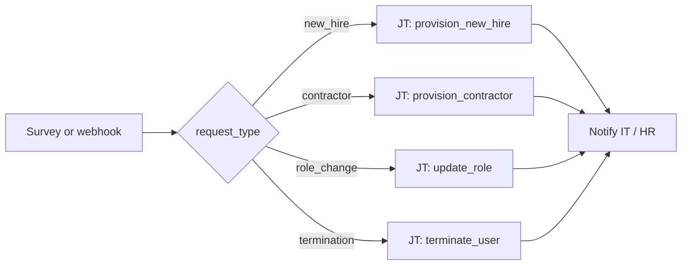

# User Lifecycle 101: Request Type Routing

**Status: Active** — playbooks and AO workflow JSON included.

## What this demo shows

Switch on `request_type` from an AO survey, webhook, or ticket integration. Each value triggers a purpose-built automation path.

| `request_type` | Action |
|---|---|
| `new_hire` | Create user, SSH key, sudo, groups |
| `contractor` | Create user, expiry date, limited sudo |
| `role_change` | Update groups and sudo only |
| `termination` | Lock account, archive home, revoke keys |

Switch routing is not only for technical metrics — human input maps cleanly to string values.

## Workflow



## Playbooks

| Playbook |
|---|
| [`notify_chatroom.yml`](playbooks/notify_chatroom.yml) |
| [`process_request.yml`](playbooks/process_request.yml) |
| [`provision_contractor.yml`](playbooks/provision_contractor.yml) |
| [`provision_new_hire.yml`](playbooks/provision_new_hire.yml) |
| [`terminate_user.yml`](playbooks/terminate_user.yml) |
| [`update_role.yml`](playbooks/update_role.yml) |

## Artifacts

```
  ao/
    user-lifecycle-101.json
  playbooks/
    notify_chatroom.yml
    process_request.yml
    provision_contractor.yml
    provision_new_hire.yml
    terminate_user.yml
    update_role.yml
  README.md
  SETUP_GUIDE.md
```
